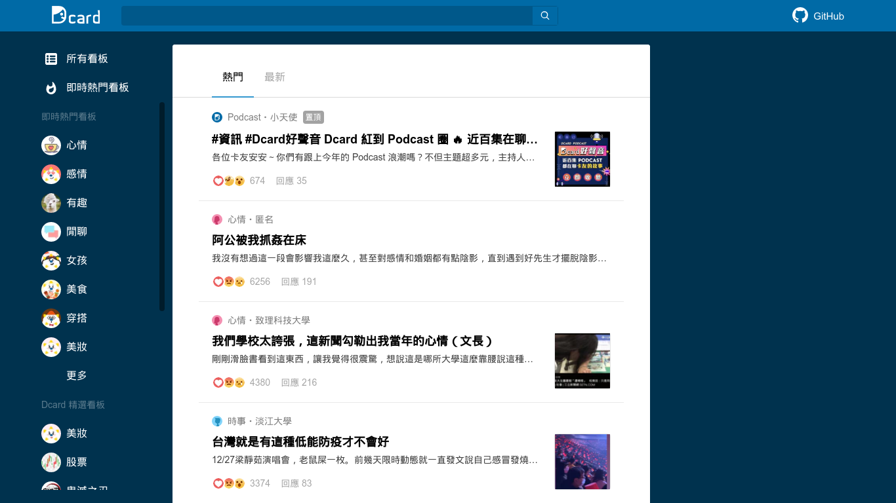

其實一開始只是在無意間發現了一些 [Dcard](https://dcard.tw) 前端的 bug，身為工程師就是要自己研究看看可以怎麼解決，結果不知不覺就花了兩個禮拜把整個前端都刻出來了。

不廢話就先放上連結：[Dcard clone](https://dcard-clone.vercel.app)，以及 [GitHub repository](https://github.com/kevin940726/dcard-clone)。有興趣的人可以繼續往下閱讀一些實作上的細節。

## Goals and Priorities

在解釋專案細節之前，得先聊聊這個複製品的目標，什麼樣的功能是會做的，什麼樣的功能是不會做的，什麼樣的功能是高順位的，而什麼樣的功能是低順位或甚至不太可能做的。

大方向是會盡量實作 Dcard 討論區前端的 UI 介面，但是不會實作任何會員系統相關的功能，也就是說知名的抽卡功能和任何後端相關的功能是不會做的。前端的架構也會盡量符合官方的前端架構 (Next.js)，目的是為了能夠盡可能模擬 Dcard 本身會遇到的問題。

### Out of scope

- 註冊／登入
- 互動 （留言、按心情、追蹤、檢舉等）
- 廣告、贊助
- 遊戲專區、好物研究室
- 支援舊瀏覽器

### Low priorities

- RWD／手機版 (我懶)
- 任何官方的介面更新或新功能的實作 (我超懶)
- Code quality 優化 (真的懶)
- Testing (你懂我意思了)

另外值得一提的是，這個網站所用的所有 API 都是官方的真實 API，所以看到的資料理論上會與官方的討論區相同，但也因為如此，任何官方的 API 更新或是做的任何封鎖都可能會讓這個網站直接壞掉。（如果官方對此有疑慮，歡迎隨時聯絡我下架整個網站）。

既然這個 side project 的出發點是為了修正一些 Dcard 的 bug，所以有些地方的 UI 並不會完全一樣，其中也有些地方參雜了一些我主觀認為比較好的優化，這會在文章後半段再一一列舉。

## Architecture

- 前端與後端的是標準的 [Next.js](http://nextjs.org/) 架構，並部署在 [Vercel](https://vercel.com/) 上。
- Styling 的選擇是 [styled-components](http://styled-components.com/)，加上 [`modern-normalize`](https://github.com/sindresorhus/modern-normalize)。
- 沒有使用 state management library，但有使用 [React Query](https://react-query.tanstack.com/) 做 data-fetching 和 caching。
- 沒有使用 UI component library，但有使用 [Reakit](https://reakit.io/) 的一些 component。

全部包含 React 就只有 7 個 dependencies。這次也是我第一次比較認真的使用 Next.js 和 React Query，也順便當作練習。

在 Next.js 的使用上選擇了非官方且非主流的方式做 data-feteching，沒有使用官方推薦的 `getServerSideProps` 或 `getStaticProps`，而是用了 top-level 的 `App.getInitialProps`。

不考慮使用 `getStaticProps` 因為 Dcard 的討論區列表非常動態，而 `getServerSideProps` 則是 page-level 的，意即每次切換頁面時都會重新打一次這個 API，這在一般的 app 中可能較為簡單直覺，但是在 Dcard 的架構中就顯得不太理想。在進入討論區後會需要呼叫一支 `forums` 的 API，一次性地拿取全部 4xx 多筆的討論區資料，而幾乎每一頁的介面左邊都會有「即時熱門看板」和「Dcard 精選看板」會需要這支 API 的資料。如果直接使用 `getServerSideProps` 的話就會變成每次切換頁面都會把 4xx 多筆的資料重新餵給 client，而這些資料其實短時間內不太會變動，是可以被 cache 的。經過優化後的 `getServerSideProps` 可以只傳必要的資料給前端，但一樣每次切換頁面時都會重新拉一次資料，而就我所知目前似乎 Next.js 還沒有辦法可以指定這些資源的 cache，也沒有辦法在同一頁中同時使用 `getServerSideProps` 和 `getStaticProps`，於是只好另外找尋其他方法。

最後的解法是透過在 [`_app.js`](https://github.com/kevin940726/dcard-clone/blob/main/src/pages/_app.js) 中定義 `App.getInitialProps` 來統一做 data-fetching 的處理。這個 method 只會在每次進入 app 中執行一次，對於 Dcard 這類型的 SPA 來說就是當使用者第一次進入網頁的時候，而後所有的 client side navigation 都是透過 client side 的 data-fetching 處理。這麼做的好處是每次切換頁面時都有類似 `shallow` 的效果，會先馬上看到下一頁的讀取狀態後再去打需要的 API，這樣所有的 API 結果都可以被我們 cache 起來，切換頁面時如果需要重複的資料就不需要再重新呼叫一次 API。

接下來我們只要在每一頁定義我們想要預先在 server side 載入的 API，就一樣可以享有 SSR 的優點。這部分我實作了一個客製的 API 叫 `prefetchQueries`，它只會在 server side 執行，所做的也就只是去打需要的 API 並把結果 cache 起來後交給前端 dehydrate。這邊算是比較特殊的地方，但是個人目前使用起來也滿方便的，也許之後有比較多的經驗之後可以再多研究有沒有更好的方法。

## Bugs and Features implemenation

因為基本上大部分功能都與 Dcard 官方一樣，功能實作方面我就直接列出我有發現的官方的 bug 搭配我改善後的實作。

這邊倒是想強調一下，這些 bug 都不是什麼太嚴重的問題，也許全部都早已經被官方發現只是還沒估點數安排人力而已。另外底下我的建議也都只是來自我的個人主觀的意見，也許官方有更多其他的考量是我沒想到的，還是要給予 Dcard 官方的開發團隊最大的尊重。

### Post modal's history

這是我最早發現的 bug，也是驅使我想開始從頭開始刻 Dcard 前端的契機，詳細的 bug 內容可以看以下影片：

  <iframe
    src="https://streamable.com/e/1brebk?autoplay=1"
    frameborder="0"
    width="100%"
    height="100%"
    allowfullscreen
    allow="autoplay"
    style="width:100%;height:100%;position:absolute;left:0px;top:0px;overflow:hidden;"
  ></iframe>

**重製步驟：**

1. 隨便點一個文章開啟 modal。
2. 點擊文章的下一篇。
3. 按**瀏覽器**的上一頁。
4. 按**瀏覽器**的下一頁。
5. 這時不管是關閉按鈕、點擊 modal 外面、或按 <kbd>esc</kbd> 鍵都無法關閉 modal。

這種會改變網址的 modal 滿常見的，就姑且稱它為 route modal 吧，不確定最早是在哪一個網站上看到，但現在已經算是非常主流的設計了，包括 Instagram、Facebook、Reddit、Twitter 都有使用這樣的設計。雖然說已經是非常主流的設計，但要做好還真不是件簡單的事，目前以上我看了看，真正算是有做對的只有 Facebook，其他不是有些細節沒處理好，不然就是有相當明顯的 bug（Instagram 甚至在開啟 modal 後點擊上一頁都不會關掉）。以後有時間再來單獨整理一篇 route modal 的細節吧～

在 Dcard 的情況看起來是沒有處理好瀏覽器本身的上一頁下一頁，但我想也是只有相當少數的人會這樣操作吧。我並不清楚官方的實作是怎麼處理的，但在 Dcard clone 中我是有使用到了一個 `stepsFromList` 的 query 來記錄距離列表頁還有幾次上一頁的距離，當要關閉 modal 時只需呼叫 `history.go(-stepsFromList)` 就好了。

以上的實作是建立在希望關閉 modal 時永遠都會呼叫上一頁的基礎上，雖然我個人認為這樣的使用者體驗沒有很完美，如果使用者切換了很多個頁面後關閉 modal，他這時如果想回去看看上一個關掉的 modal 就得一直按下一頁而不是按一次上一頁，這算是有點反直覺的，但 Facebook 也是這樣實作的就是了。

### Weird behaviors of the custom scrollbar

目前有發現有客製化捲軸的地方是在文章的 modal 和左邊的討論區列表中。

  <iframe
    src="https://streamable.com/e/1uavcz?autoplay=1"
    frameborder="0"
    width="100%"
    height="100%"
    allowfullscreen
    allow="autoplay"
    style="width:100%;height:100%;position:absolute;left:0px;top:0px;overflow:hidden;"
  ></iframe>

**重製步驟：**

1. 進入任何有客製化捲軸的頁面，如文章的彈窗。
2. 滑鼠點擊捲軸空白處，使捲軸移動到點擊處。
3. 捲軸上下捲無法再使用，唯一能捲動的方法只剩點擊空白處。

Dcard 不知道是因為什麼特殊的考量決定用客製化捲軸，可能是為了介面好看希望盡可能隱藏捲軸吧，但捲動行為本來就是一個非常難處理的功能，有非常多的細節要考量，可能官方只是使用了某個開源的套件，如果是的話看來這是個不錯的機會可以發發 PR。

另外在文章 modal 中的捲軸是在 modal 中而不是在頁面捲動的，不確定是不是因為這個原因導致所有瀏覽器的基本捲動功能也都失效了，如 <kbd>PageUp</kbd>、<kbd>PageDown</kbd>、<kbd>Home</kbd>、<kbd>End</kbd>、<kbd>Space</kbd> 等，這算是 accessibility 的細節，對於習慣使用鍵盤操作的人來說基本上是無法使用的。

我在 Dcard clone 中的解法是把捲軸移到最外層，並且不客製化捲軸讓他呈現最原始的樣子，所有鍵盤操作都依然能運作，附帶的額外好處是在 modal 外捲動也可以瀏覽。

至於在左側討論區列表的捲軸，我是採用 WebKit 才有的 [CSS API](https://css-tricks.com/custom-scrollbars-in-webkit/) 來客製化捲軸，而不使用任何 JavaScript。雖然成果沒有那麼完美，也無法在非 WebKit 的瀏覽器上發揮效果，但以此交換 accessibility 和 bundle size 而言我認為還是相當划算的。

### Accessibility

除了捲軸的 accessibility 問題以外，其他也有多處沒有遵守 accessibility 的 best practice，雖然在 lighthouse 分數上是 100 分，但實際上仍然還有很多地方需要多加考量。

這邊就直接列出一些我有發現的問題，大部分在 Dcard clone 中都有修正，但其實也有很多地方還不夠完整。

- 某些元素被 focus 時沒有任何介面上的效果。通常可能會為了介面好看而把預設的 outline 藏起來，但這其實對於鍵盤使用者來說會很困惑現在究竟是停在哪一個元素上，Dcard clone 使用 [`:focus-visible`](https://developer.mozilla.org/en-US/docs/Web/CSS/:focus-visible) 來只對滑鼠使用者隱藏 outline，雖然還沒有太好的瀏覽器支援度，但也有 [polyfill](https://github.com/WICG/focus-visible) 可以使用（clone 中沒有載入 polyfill）。
- 無法跳至主要內容。現在很多網站都會特別為了鍵盤使用者或螢幕閱讀器的使用者提供一個特別的一般使用者看不到的按鈕來快速跳至主要內容，使用者就不必連續按 Tab 好多次遍歷一次左邊所有的討論區列表的連結才有辦法跳至主要內容，Dcard clone 將此按鈕隱藏在左上角的 logo 上。
- Modal 的 focus 沒有形成封閉的迴圈。Modal （或 Dialog）算是一種特別的介面，因為在 modal 開啟時不預期使用者可以對外面的元素互動，通常會將 focus 封閉在 modal 內，意即對最後一個 focusable 的元素按 Tab 會跳回 modal 的第一個 focusable 元素，直到關閉 modal 為止。Dcard clone 中直接使用 Reakit 的 Dialog component 來實作這項功能。
- 關閉 Modal 時返回 focus。用鍵盤瀏覽文章列表頁時，關閉 modal 後就必須重新找尋一次上次點擊的連結，Dcard clone 中在關閉 modal 後會將 focus 返回到該 modal 的連結上，同樣的也適用於點擊 modal 的下一篇／下一篇後。
- Layout Shift。Dcard 的 API 雖然有回傳圖片的長寬，但似乎讀取時仍然沒有寫死長寬比例，這導致圖片讀取較慢時會將文章向下推移一段距離，造成閱讀時的不適，或甚至可能會造成要點擊的目標突然移動而沒點到或點錯等情況。Dcard clone 使用 `next/image` 來優化圖片的載入速度和固定它們的長寬比例，這讓圖片在讀取中時仍然可以顯示正確的長寬比例，避免跳動。

## Conclusion

重新放一次連結：[Dcard clone](https://dcard-clone.vercel.app) 和 [GitHub repository](https://github.com/kevin940726/dcard-clone)，歡迎提交 issues 或 PRs，但我不保證我會繼續更新 😅。

這次實作從頭到尾大概花了我兩個禮拜的下班和假日的空閒時間，說實話我認為完成度大概只有不到 30%，但當作很久沒寫 UI 的我的練習來說還算是非常有趣的。其中最花時間的反而是再研究 Next.js 的 data-fetching 和 route modal 的最佳解決方案，雖然現在還是對於目前的解法沒有到很滿意，但也算是可以運作了啦。

最後還是要對 Dcard 的官方開發團隊表達最大的尊重，同樣是前端工程師都知道要做出這些複雜的 UI 是沒有想像中簡單的，加上官方還有更多複雜的業務邏輯是我沒有處理也不會處理的，辛苦了！
